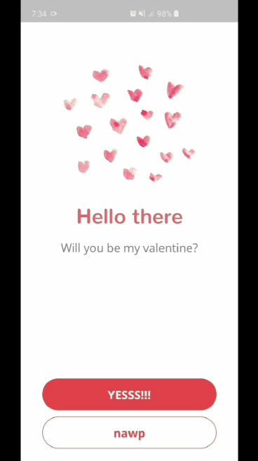

# valentine

**Invite your significant other in a cute way!**

If you're curious about Flutter and you want to see some code, check this one out.

I am self taught — which means this is not according to any industry standard. However, I always try to learn good practices. Let's learn together! You are free to file issues for improvements or comments in general.

## Future plans

Since this project was made pretty quick, I plan on adding other functionalities such as text/email replies.

I will also try to make similar projects to showcase how easy it is to build cool apps with Flutter.

## Preview

## Some references

Finding out how to do things at the start can be very tedious. Here are some resources that will help you when starting out:

* [Flutter Docs](https://flutter.dev/docs)
* [Layout Cheat Sheet](https://medium.com/flutter-community/flutter-layout-cheat-sheet-5363348d037e)
* [Form with Validation](https://flutter.dev/docs/cookbook/forms/validation#1-create-a-form-with-a-globalkey)
* [Adding App Launcher Icons](https://medium.com/@psyanite/how-to-add-app-launcher-icons-in-flutter-bd92b0e0873a)
* [Routes: Push - Pop - Push](https://medium.com/flutter-community/flutter-push-pop-push-1bb718b13c31)
* [Routes with Parameters, Named Routes, onGenerateRoute](https://resocoder.com/2019/04/27/flutter-routes-navigation-parameters-named-routes-ongenerateroute/)
* [Top 7 Dart Date Methods You Should Know](https://codeburst.io/top-7-date-methods-you-should-know-dart-6ce2b5f67090)
* [Top 10 Dart Array Utility Methods You Should Know](https://codeburst.io/top-10-array-utility-methods-you-should-know-dart-feb2648ee3a2?gi=b556fd0cd2a0)
